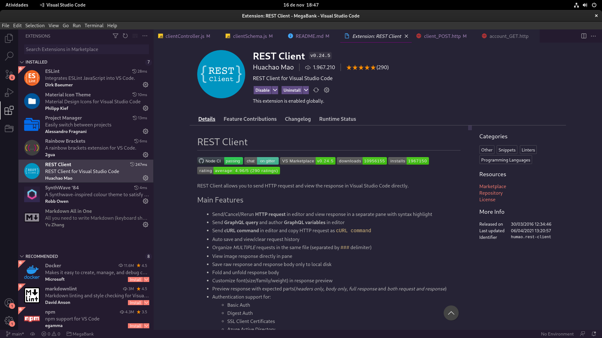

# Esse projeto é um *desafio* de um Sistema de **Banco Digital** (Simplificado) onde eu vou desenvolve-lo e ganhar uma ***cadeira Gamer*** e uma ***Alexa***.

## [Acesse este projeto Online](34.95.186.221)

# Orientações para você usar este projeto

## Para baixar, abra o seu terminal e digite:
```
git clone https://github.com/jhamiltonjunior/megabank-node-casadodev.git
```

## para começar a usar você precisará das depêndecias, baixe usando esse comando no seu terminal:
```
npm i
```

## Requisitos Não Funcionais

- [ ] (Todos) Arquivos postman, insomnia, (no meu caso) HTTP
- [ ] (Toda) Documentação [README.md](README.md)
- Tecnologias que foram usadas
  - NodeJS
  - Express
  - MongoDB
  - Mongoose
- Depêndencias
  - bcryptjs
  - dotenv
  - express
  - jsonwebtoken
  - mongoose
  - EsLint
  - Nodemon
  - sucrase
  - prettier
  - eslint-plugin-import
  - eslint-plugin-node
  - eslint-plugin-promise
  - eslint-config-prettier
  - eslint-plugin-prettier

- Orientação para levantar o ambiente da aplicação

#

## Requisitos funcionais
- [X] Criação do Cliente e Conta
- [X] Autenticação do Cliente
- [X] Depósito
- [X] Saque
- [X] Consulta de Saldo
- [X] Transferências entre contas
- [ ] Geração de Extrato
- [ ] Pagamento de Despesas

# Mongo.connect
## Conectar-se ao MongoDB

### Para você conseguir se conectar com o mongo basta apenas criar um arquivo *.env* na raiz do projeto

## Dentro do arquivo insira o linha:
```
CONNECTIONDB=mongodb://127.0.0.1:27017/megabank
```

## *Para isso você precisa ter o MongoDB instalado na sua maquina*

Caso não tenha, e não queira instalar você pode usar o [Mongo Atlas](https://www.mongodb.com/atlas/database?tck=docs_server)

### [Install MongoDB](https://docs.mongodb.com/manual/installation/)

### [Install MongoDB in Arch Linux](https://wiki.archlinux.org/title/MongoDB)

#### caso *instale* o mongo e não consiga acessar o shell do mesmo, reinicie o seu computador isso funcionou comigo.

# Para conseguir Acessar os arquivos http e usa-los, baixe a extenção REST Client do VSCode (semelhante ao insomnia ou postman)



# Dar update no Saldo

## para fazer isso você precisa ir no arquivo *account_NEW_BALANCE_PUT.http* na pasta *http*

Vocẽ irá precisar colocar um JSON nele, para dar update no saldo

Mas antes de continuar você precisa ir no arquivo
```
client_AUTH_POST.http
```
Clique em Send Request copie o token de autentição e cole ao
lado de Bearer **VAI PRECISAR DE UM ESPAÇO ENTRE ELES** no arquivo
```
account_ADD_BALANCE_PUT.http
```

# O JSON seria esse:
```
{
  "balance": Number
}
```
### Nota: eu não sei por qual motivo mas quando clico para inserir o saldo ele da o resultado como se o saldo ainda não tivesse sido inserido, mas no banco de dados ele foi inserido corretamente

## A mesma lógica para remover saldo