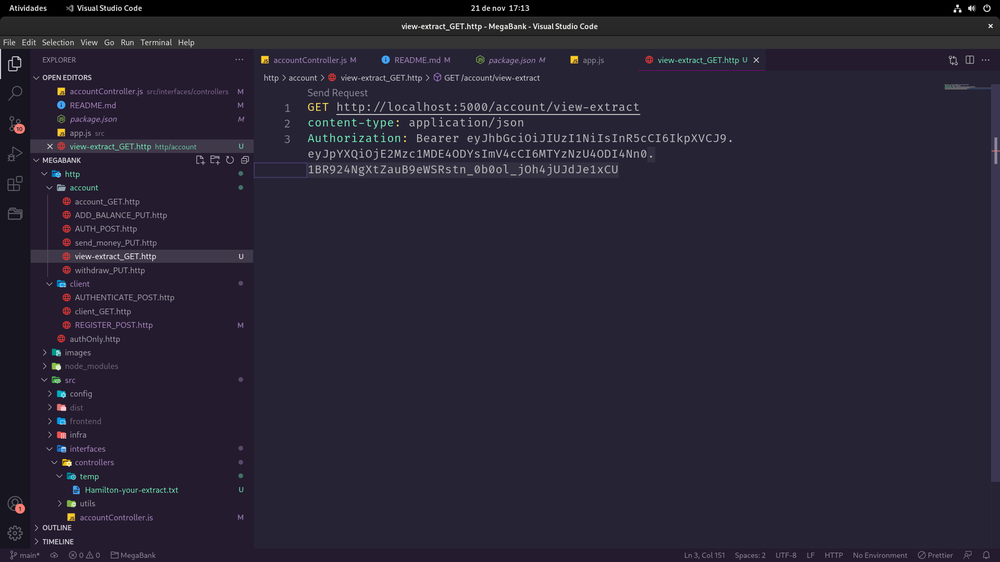
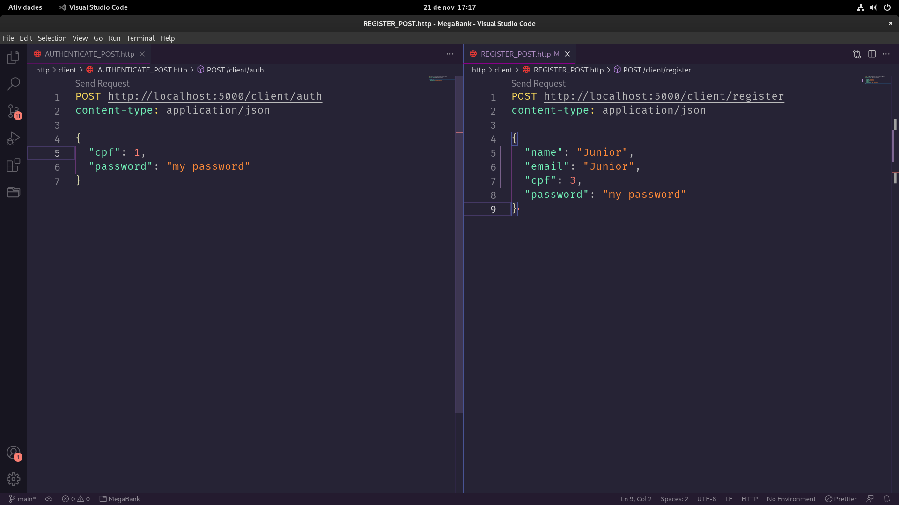
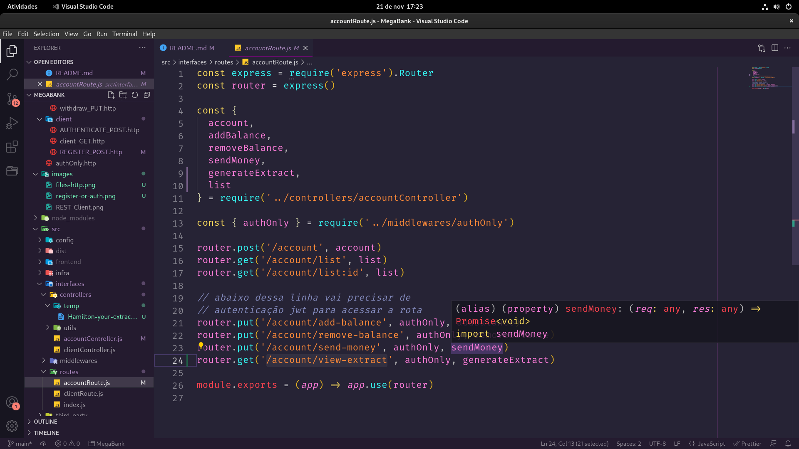
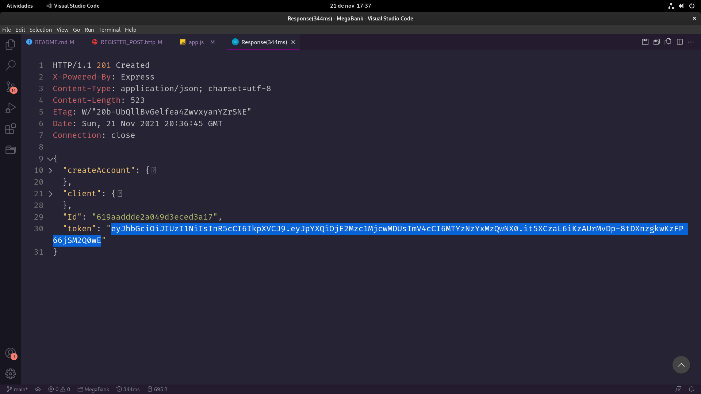
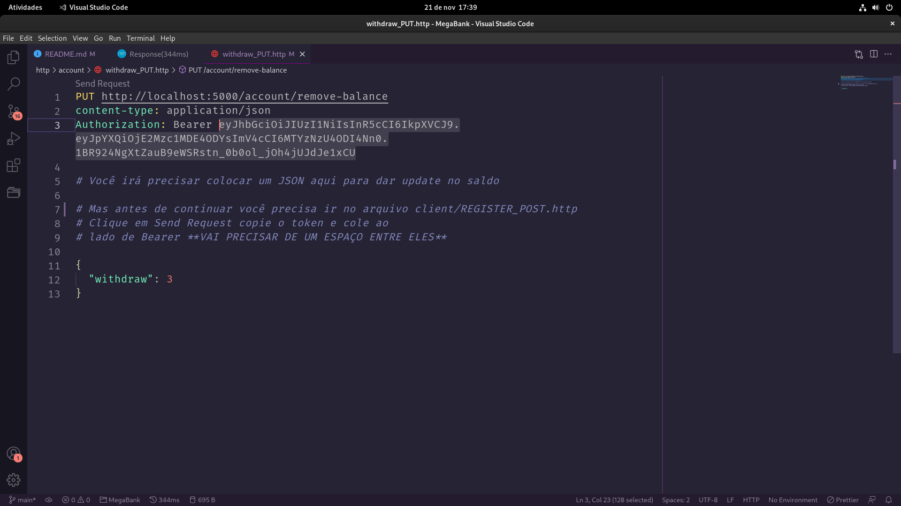
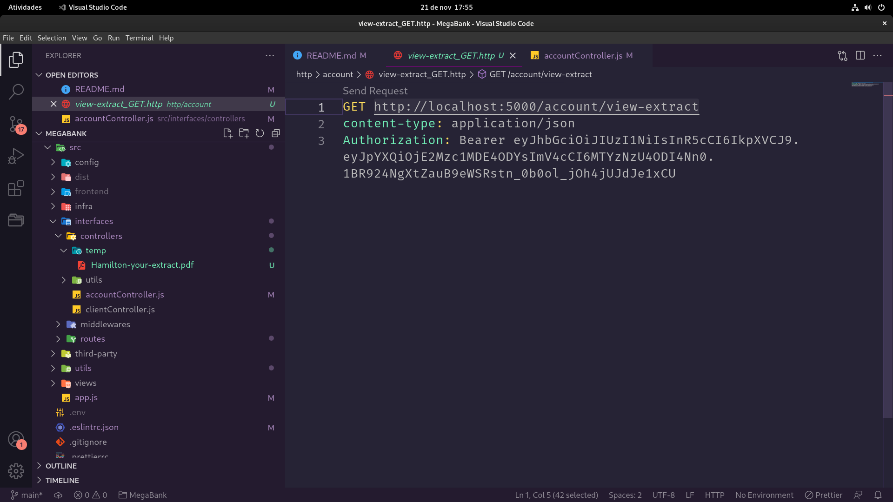

# Esse projeto é um *desafio* de um Sistema de **Banco Digital** (Simplificado) onde eu vou desenvolve-lo e ganhar uma ***cadeira Gamer*** e uma ***Alexa***.

## [Acesse este projeto Online](34.95.222.85)
Como o Google Cloud só me da 90 dias de acesso gratuito, é provável que essa aplicação saia do ar em breve, mas você ainda pode usa-la no seu computador

### Esse app não tem um frontend pelo motivo de eu não ter muito tempo para desenvolve-la, durante o dia eu trabalho como zelador, então não tive muito tempo para cria-la

# Orientações para você usar este projeto

## Para baixar, abra o seu terminal e digite:
```
git clone https://github.com/jhamiltonjunior/megabank-node-casadodev.git
```

## Para começar a usar você precisará das depêndecias, baixe usando esse comando no seu terminal:
```
npm i
```

## E então rode o servidor
```
npm start
```
 
# Para conseguir Acessar os arquivos .http e usa-los, baixe a extenção REST Client do VSCode (semelhante ao insomnia ou postman)


## Para criar conta consultar, saldo e mais, veja os arquivos .http que estão na pasta http


## Antes de tudo você vai precisar criar ou autenticar um usuário

### Você pode fazer isso usando um dos arquivos abaixos

Eles estão dentro da pasta http/client



# Se tem authOnly na rota você vai precisar do token de autenticação



Lembra que eu disso um pouco acima que voĉe precisaria autenticar um user ou criar um?
Então, foi exatamente por isso que eu disse isso.

## Quando você registrar um novo user você terá um novo token
(Ele vai expirar em 1 Dia, depois disso autentique o usuário que você criou para ter um novo token)



## Para sacar, por exemplo, cole o seu token no authorization
cole com um espaço ao lado direito de Bearer



### repita o mesmo procedimento de colar o token nas outras rotas por no max 1 dia
Depois disso é como eu disse acima, gere um novo token.

# Easter Eggs

### Quando você da um GET nessa rota:
```
http://localhost:5000/account/view-extract
```
### É gerado um arquivo .pdf contendo todo o estrato do usuário
Na frente aparece o email do usuário (Hamilton) e o resto é padrão
faço isso porque se outro usuario com o mesmo nome ao mesmo tempo gerar um extrato ele seria substituido, mas como o email é unico isso não vai acontecer

(na pasta src/interfaces/controllers/temp)



## Requisitos Não Funcionais

- [ ] (Todos) Arquivos postman, insomnia, (no meu caso) HTTP
- [ ] (Toda) Documentação [README.md](README.md)
- Tecnologias que foram usadas
  - NodeJS
  - Express
  - MongoDB
  - Mongoose

- Depêndencias
  - bcryptjs
  - dotenv
  - express
  - jsonwebtoken
  - cors
  - ejs
  - mongoose

- devDepêndencias
  - EsLint
  - Nodemon
  - sucrase
  - prettier
  - eslint-config-standard
  - eslint-plugin-import
  - eslint-plugin-node
  - eslint-plugin-promise
  - eslint-config-prettier
  - eslint-plugin-prettier

- Orientação para levantar o ambiente da aplicação

#

## Requisitos funcionais
- [X] Criação do Cliente e Conta
- [X] Autenticação do Cliente
- [X] Depósito
- [X] Saque
- [X] Consulta de Saldo
- [X] Transferências entre contas
- [X] Geração de Extrato
- [X] Pagamento de Despesas

# Mongo.connect
## Conectar-se ao MongoDB

### Para você conseguir se conectar com o mongo basta apenas criar um arquivo *.env* na raiz do projeto

## Dentro do arquivo insira o linha:
```
CONNECTIONDB=mongodb://127.0.0.1:27017/megabank
```

## *Para isso você precisa ter o MongoDB instalado na sua maquina*

Caso não tenha, e não queira instalar você pode usar o [Mongo Atlas](https://www.mongodb.com/atlas/database?tck=docs_server)

### [Install MongoDB](https://docs.mongodb.com/manual/installation/)

### [Install MongoDB in Arch Linux](https://wiki.archlinux.org/title/MongoDB)

#### caso *instale* o mongo e não consiga acessar o shell do mesmo, reinicie o seu computador isso funcionou comigo.

# Dar update no Saldo

## para fazer isso você precisa ir no arquivo *account_NEW_BALANCE_PUT.http* na pasta *http*

Vocẽ irá precisar colocar um JSON nele, para dar update no saldo

Mas antes de continuar você precisa ir no arquivo
```
client_AUTH_POST.http
```
Clique em Send Request copie o token de autentição e cole ao
lado de Bearer **VAI PRECISAR DE UM ESPAÇO ENTRE ELES** no arquivo
```
account_ADD_BALANCE_PUT.http
```

# O JSON seria esse:
```
{
  "balance": Number
}
```
### Nota: eu não sei por qual motivo mas quando clico para inserir o saldo ele da o resultado como se o saldo ainda não tivesse sido inserido, mas no banco de dados ele foi inserido corretamente

## A mesma lógica para remover saldo